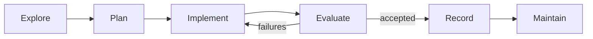

# Flow Memory

Non-trivial work should follow this loop:

```mermaid
flowchart LR
  Explore --> Plan
  Plan --> Implement
  Implement --> Evaluate
  Evaluate -->|failures| Implement
  Evaluate -->|accepted| Record
  Record --> Maintain
```

The `Record` step updates durable docs or brain pages only when the outcome is
decision-grade and likely to guide future work.

