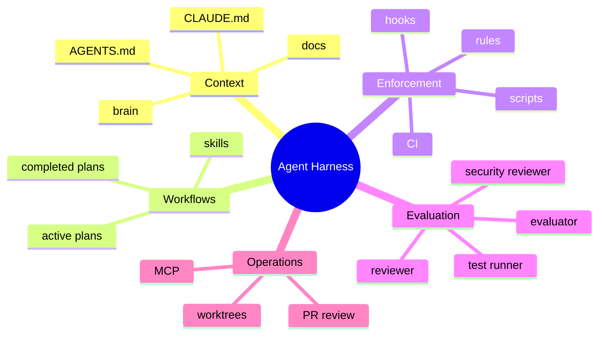

# Mindmap

```mermaid
mindmap
  root((Agent Harness))
    Context
      AGENTS.md
      CLAUDE.md
      docs
      brain
    Workflows
      skills
      active plans
      completed plans
    Enforcement
      scripts
      hooks
      rules
      CI
    Evaluation
      reviewer
      evaluator
      security reviewer
      test runner
    Operations
      MCP
      worktrees
      PR review
```

